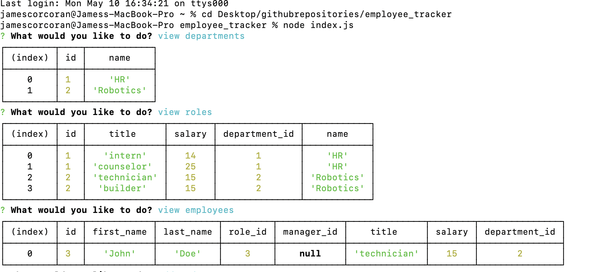
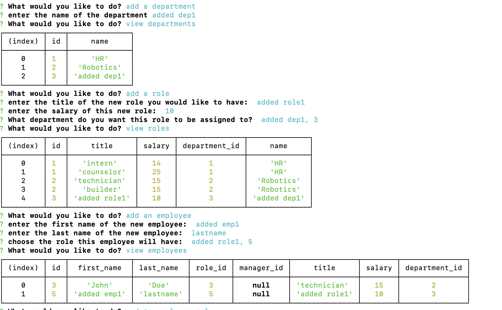
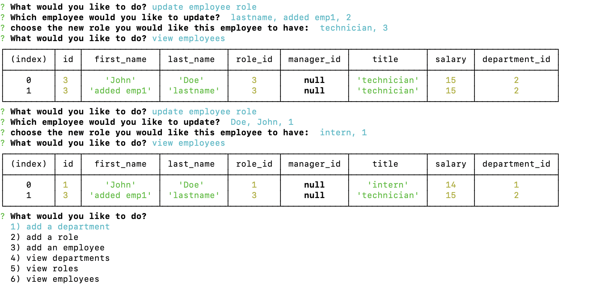

# employee_tracker

## Description
The purpose of this assignment is to build a command-line application that manages a company's employees and departments. This application should allow the user to add and view departments, roles, and employees in addition to updating employee roles. 

link to github repo:
https://github.com/jcorcorangithub/employee_tracker

link to video:
https://drive.google.com/file/d/1ezzb39FGhPPjvJt_WLET2Jo-k0tWUhu9/view

## Technologies
JavaScript
Node.js
MySQL
Inquirer module

## Contributors
I will be the sole contributor of this project 

## Contact
Name: James Corcoran 
email: jpcsoccer1234@gmail.com

